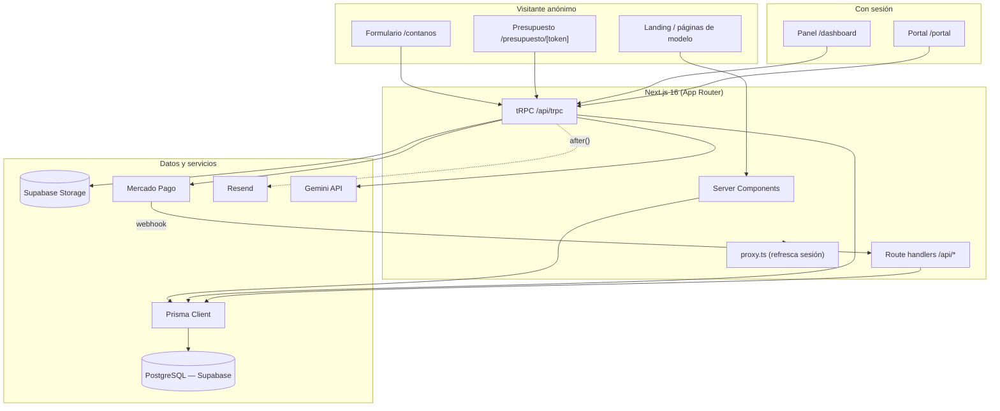
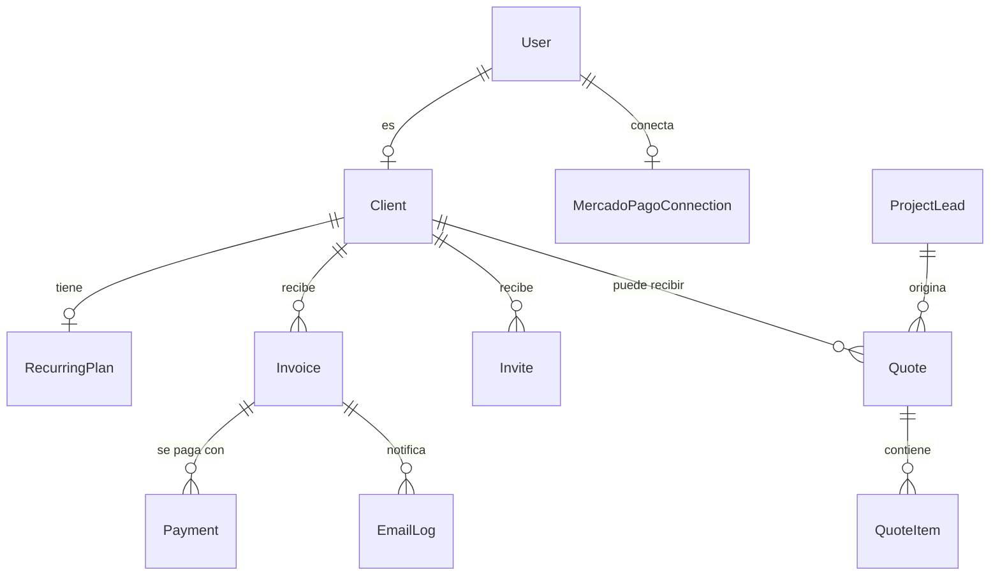
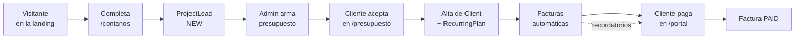

# Surcodia — Documentación del Sistema

Documentación técnica **end-to-end** de la plataforma: sitio público del estudio,
captación de leads, presupuestos, sistema de cobros recurrentes, portal de
clientes, panel de administración y generador de assets.

---

## Índice

1. [Qué es](#1-qué-es)
2. [Stack técnico](#2-stack-técnico)
3. [Arquitectura general](#3-arquitectura-general)
4. [Estructura de carpetas](#4-estructura-de-carpetas)
5. [Modelo de datos](#5-modelo-de-datos)
6. [Autenticación y autorización](#6-autenticación-y-autorización)
7. [Capa de API](#7-capa-de-api)
8. [Módulos funcionales](#8-módulos-funcionales)
9. [El ciclo comercial completo](#9-el-ciclo-comercial-completo)
10. [Emails transaccionales](#10-emails-transaccionales)
11. [Almacenamiento de archivos](#11-almacenamiento-de-archivos)
12. [Sistema visual del studio](#12-sistema-visual-del-studio)
13. [Automatización y cron](#13-automatización-y-cron)
14. [Variables de entorno](#14-variables-de-entorno)
15. [Puesta en marcha (local)](#15-puesta-en-marcha-local)
16. [Despliegue](#16-despliegue)
17. [Decisiones y trampas conocidas](#17-decisiones-y-trampas-conocidas)
18. [Estado y roadmap](#18-estado-y-roadmap)

---

## 1. Qué es

Una sola aplicación Next.js que cubre **todo el ciclo comercial de Surcodia
Studio**, desde que un desconocido entra al sitio hasta que paga una factura
recurrente:

- **Sitio público** — landing del estudio, análisis por modelo de negocio
  (e-commerce, academia digital, híbrido) y formulario de intake.
- **Leads** — captación desde `/contanos`, con aviso al admin y auto-respuesta.
- **Presupuestos** — creación con ítems, envío por email y página pública
  tokenizada donde el cliente acepta o rechaza.
- **Cobros** — clientes, planes recurrentes, facturas, y pago vía Mercado Pago,
  transferencia o cripto con revisión de comprobante.
- **Portal de clientes** — cada cliente ve sus facturas y paga desde ahí.
- **Panel de administración** — todo lo anterior, más generador de íconos con IA.

Todo en **un solo dominio, una sola base de datos y un solo despliegue**.

---

## 2. Stack técnico

| Capa | Tecnología |
|---|---|
| Framework | **Next.js 16** (App Router, React 19, Server Components, Turbopack) |
| Lenguaje | **TypeScript** |
| Estilos | **Tailwind CSS 4** (`@theme` + `@utility`) |
| API tipada | **tRPC 11** (+ TanStack React Query, superjson) |
| ORM | **Prisma 7** (adapter `@prisma/adapter-pg`) → **PostgreSQL** (Supabase) |
| Auth | **Supabase Auth** (email + contraseña, SSR con cookies) |
| Almacenamiento | **Supabase Storage** (buckets `proofs` privado, `generated-icons` público) |
| Pagos | **Mercado Pago** — Checkout Pro + OAuth Connect + webhook |
| Email | **Resend** + **React Email** |
| IA generativa | **Gemini 2.5 Flash Image** (assets pixel e íconos) |
| Validación | **Zod 4** |
| Utilidades | jimp (imágenes), fflate (zip), simple-icons, lucide-react |

---

## 3. Arquitectura general



**Principios:**

- Las páginas son **Server Components**; la interactividad vive en islas
  `"use client"` (formularios, modales, drawers).
- Toda la lógica de negocio pasa por **tRPC** con procedures tipadas por rol.
- Los **route handlers REST** quedan solo para lo que no puede ser tRPC:
  webhook de Mercado Pago, OAuth callback, cron y descarga de archivos binarios.
- Los emails salen con **`after()`** de `next/server`: la respuesta vuelve apenas
  se escribe en la base y el envío ocurre después, sin hacer esperar al usuario.
- La base de datos vive en Supabase con **RLS activado en todas las tablas**; el
  acceso pasa siempre por el servidor con la service key.

---

## 4. Estructura de carpetas

```
payment-system/
├─ prisma/
│  ├─ schema.prisma            # Modelo de datos completo
│  └─ migrations/              # 7 migraciones aplicadas
├─ scripts/
│  └─ generate-assets.mjs      # Generador de pixel-art con Gemini (CLI)
├─ cron-worker.mjs             # Worker de facturación (PM2, setInterval 24h)
├─ public/
│  ├─ pixel/                   # Sprites y banners pixel (+ raw/ gitignored)
│  ├─ previews/                # Capturas de proyectos
│  └─ belgrano/                # Escudo y fotos del caso Belgrano
└─ src/
   ├─ proxy.ts                 # Convención Next 16 (ex middleware): refresca sesión
   ├─ app/
   │  ├─ page.tsx              # Landing del studio
   │  ├─ modelo-*/             # Análisis por modelo de negocio
   │  ├─ contanos/             # Formulario de intake
   │  ├─ presupuesto/[token]/  # Presupuesto público
   │  ├─ dashboard/            # Panel admin
   │  ├─ portal/               # Portal de clientes
   │  ├─ login, setup, invite/[token], ingreso, forgot/reset-password
   │  └─ api/                  # trpc, cron/billing, mp/*, admin/icons/export
   ├─ components/
   │  ├─ studio/               # Sistema visual del sitio público
   │  └─ *.tsx                 # Compartidos del panel (AppHeader, MobileNav…)
   ├─ emails/                  # 13 templates React Email + _shell
   ├─ lib/
   │  ├─ studio/               # i18n, contenido, acentos, intake
   │  ├─ supabase/             # Clientes admin/server/browser + storage
   │  └─ auth, email, mercadoPago, recurrence, exchange-rate, env, format
   ├─ server/
   │  ├─ api/                  # trpc.ts, root.ts, routers/ (11 routers)
   │  └─ icon-gen.ts           # Gemini + remoción de fondo
   └─ generated/prisma/        # Prisma Client generado (no editar)
```

---

## 5. Modelo de datos

Definido en [`prisma/schema.prisma`](prisma/schema.prisma). Agrupado por dominio:

**Identidad:** `User` (rol ADMIN/CLIENT, vinculado a `authUserId` de Supabase),
`Client` (datos comerciales), `Invite` (token de alta para que el cliente cree
su contraseña).

**Cobros:** `RecurringPlan` (monto, frecuencia, fecha ancla), `Invoice`,
`Payment`, `PaymentMethodConfig` (CBU/alias o wallet cripto), `MercadoPagoConnection`.

**Comercial:** `ProjectLead` (formulario de intake), `Quote` → `QuoteItem`
(presupuestos con acceso público por token).

**Operación:** `EmailLog` (registro de todo envío), `ExchangeRate` (USD→ARS),
`GeneratedIcon` (assets generados con IA).



**Enums:** `UserRole` (ADMIN/CLIENT), `InvoiceStatus` (DRAFT/PENDING/
PENDING_REVIEW/PAID/OVERDUE/CANCELLED), `PaymentMethod` (MERCADOPAGO/
BANK_TRANSFER/CRYPTO), `PaymentStatus`, `PaymentMethodKind` (BANK_ACCOUNT/
CRYPTO_WALLET), `PlanFrequency` (DAILY/WEEKLY/MONTHLY/YEARLY), `QuoteStatus`
(DRAFT/SENT/ACCEPTED/REJECTED), `LeadStatus` (NEW/CONTACTED/ARCHIVED/CONVERTED),
`EmailKind` (10 tipos).

> El schema `personal_site` de la misma base (gestionado por el repo
> `personal-website`) se lee **solo lectura** vía SQL crudo para alimentar
> nichos y proyectos de la landing. Este repo nunca le corre migraciones.

---

## 6. Autenticación y autorización

**Proveedor:** Supabase Auth con email + contraseña. La sesión viaja en cookies
y se refresca en cada request desde [`src/proxy.ts`](src/proxy.ts) (la
convención que en Next 15 se llamaba `middleware.ts`).

**Doble identidad:** cada usuario existe en `auth.users` (Supabase) y en la tabla
`User` (Prisma), unidos por `authUserId`. La tabla propia guarda el **rol**, que
es lo que gobierna todos los permisos.

**Procedures de tRPC** ([`src/server/api/trpc.ts`](src/server/api/trpc.ts)):

| Procedure | Exige |
|---|---|
| `publicProcedure` | nada |
| `protectedProcedure` | sesión válida |
| `adminProcedure` | sesión + `role === ADMIN` |
| `clientProcedure` | sesión + `role === CLIENT` + inyecta `clientId` |

**Alta de clientes:** el admin genera un `Invite` con token; el cliente entra a
`/invite/[token]`, elige contraseña en `/setup` y queda vinculado.

**Post-login:** `/ingreso` resuelve el destino según rol (ADMIN → `/dashboard`,
CLIENT → `/portal`). El root `/` es la landing pública.

---

## 7. Capa de API

### 7.1 tRPC — routers

Router raíz en [`src/server/api/root.ts`](src/server/api/root.ts).

| Router | Procedimientos | Acceso |
|---|---|---|
| `health` | `ping` | público |
| `exchangeRate` | `usdToArs` | público |
| `paymentMethods` | `list` · `listAll`, `get`, `create`, `update`, `setActive`, `delete` | público · admin |
| `leads` | `submit` · `list`, `setStatus` | público · admin |
| `quotes` | `getByToken`, `decide` · `create`, `list`, `get`, `send`, `markDecided`, `convertToInvoice`, `delete` | público · admin |
| `clients` | `list`, `get`, `create`, `update`, `setActive`, `upsertPlan`, `generateInvite` | admin |
| `invoices` | `listAll`, `upcomingBills`, `generateNext`, `createOneOff`, `markPaid`, `delete` · `listMine` · `get` | admin · cliente · protegido |
| `payments` | `pendingReview`, `confirm`, `reject` · `getProofUploadToken`, `createMpPreference`, `submitManualPayment` | admin · cliente |
| `mercadoPago` | `getConnection`, `disconnect` | admin |
| `emails` | `list`, `sendTest` | admin |
| `icons` | `generate`, `list`, `delete` | admin |

### 7.2 Route handlers REST

| Ruta | Rol |
|---|---|
| `/api/trpc/[trpc]` | Entrada de tRPC (`maxDuration 60` por la generación de íconos) |
| `/api/cron/billing` | Job diario de facturación, autenticado con `CRON_SECRET` |
| `/api/mp/connect` · `/api/mp/callback` | OAuth de Mercado Pago Connect |
| `/api/mp/webhook` | Notificaciones de pago de MP |
| `/api/admin/icons/export` | Descarga de todos los íconos en `.zip` (solo admin) |

---

## 8. Módulos funcionales

### 8.1 Sitio público del studio

- **Landing** (`/`): hero, nichos y proyectos leídos en vivo del schema
  `personal_site`, franja del caso Belgrano con slider de fotos, manifiesto,
  bio, stack y contacto. Bilingüe ES/EN/PT por cookie.
- **Páginas de modelo** (`/modelo-ecommerce`, `/modelo-cursos`,
  `/modelo-hibrido`): análisis largos con índice lateral, beneficios,
  estadísticas de UX con fuente citada, e integraciones. Comparten el template
  [`components/studio/model-page.tsx`](src/components/studio/model-page.tsx).
- **Proyectos**: tarjetas con logo real y drawer lateral con descripción larga,
  features, stack y captura del sitio.

### 8.2 Captación de leads

Formulario multi-paso en `/contanos` (7 preguntas + revisión), con honeypot
anti-bots que finge éxito sin persistir. Al enviar: se guarda `ProjectLead`, le
llega un email al admin con todas las respuestas y una auto-respuesta al lead en
su idioma. Gestión en `/dashboard/leads` con estados NEW → CONTACTED →
CONVERTED / ARCHIVED y atajo "+ Presupuestar".

### 8.3 Presupuestos

El admin crea un `Quote` con ítems (cliente existente o prospecto suelto,
opcionalmente vinculado a un lead). Queda en DRAFT hasta que se envía; ahí el
destinatario recibe un email con link a `/presupuesto/[token]`.

En esa página pública ve los ítems, el total y la validez, y puede **aceptar** o
**rechazar con motivo**. La decisión dispara un email al admin. Un presupuesto
aceptado de un cliente vinculado se **convierte en factura** con un click.

### 8.4 Clientes y planes recurrentes

Alta de cliente, invitación, y `RecurringPlan` con frecuencia (diaria, semanal,
mensual, anual) y fecha ancla. Al crear un plan con ancla en el pasado se hace
**backfill** de todas las facturas vencidas (con tope por frecuencia para evitar
accidentes). La lógica vive en [`src/lib/recurrence.ts`](src/lib/recurrence.ts).

### 8.5 Facturas

Generación automática (cron), manual desde el plan (`generateNext`) o suelta
(`createOneOff`). El dashboard muestra **"Próximas facturas"**: lo que el cron
emitiría en su próxima pasada, con botón para adelantarlo. Se pueden borrar
(transacción que quita pagos y desvincula los email logs para conservar el
rastro).

### 8.6 Pagos

Tres caminos, todos desde `/portal/invoice/[id]`:

1. **Mercado Pago** — se crea una preferencia de Checkout Pro; el webhook
   confirma el pago y marca la factura como pagada.
2. **Transferencia bancaria** — el cliente ve CBU/alias, sube comprobante a
   Storage y queda en `PENDING_REVIEW` hasta que el admin confirma.
3. **Cripto** — igual que transferencia, con dirección de wallet y red.

El monto se muestra en USD y su equivalente en ARS con la cotización del día,
cacheada en `ExchangeRate`.

### 8.7 Generador de íconos con IA

`/dashboard/icons`. Genera íconos con Gemini a partir de un **elemento** (chips
de celestiales, tarot y magia, o texto libre) más un **estilo** editable. El
servidor fuerza "un solo ícono aislado sobre fondo blanco", **recorta el fondo
con flood-fill desde los bordes** (los blancos internos sobreviven) y devuelve
PNG 500×500 transparente. Todo se guarda en Storage + `GeneratedIcon` con su
prompt, y se puede descargar individualmente o **todo en un zip** con un
`prompts.txt` adentro.

La misma técnica, en versión CLI, está en
[`scripts/generate-assets.mjs`](scripts/generate-assets.mjs) para los sprites
pixel de la landing (incluye `--reprocess` para re-pixelizar sin gastar API).

---

## 9. El ciclo comercial completo



Cada paso deja rastro en la base y dispara el email correspondiente. No hay
planillas intermedias ni copiar datos entre herramientas.

---

## 10. Emails transaccionales

13 templates en [`src/emails/`](src/emails) sobre un shell común, enviados con
Resend desde [`src/lib/email.ts`](src/lib/email.ts). **Todo envío se registra en
`EmailLog`**, exitoso o fallido — si Resend no está configurado igual queda el
registro de lo que se habría mandado.

| Template | Cuándo |
|---|---|
| `InviteEmail` | El admin invita a un cliente |
| `WelcomeEmail` | El cliente activa su cuenta |
| `InvoiceCreatedEmail` | Se emite una factura |
| `ReminderBeforeDueEmail` | 3, 1 y 0 días antes del vencimiento |
| `OverdueEmail` | La factura pasa a vencida |
| `PaymentSubmittedEmail` | El cliente sube un comprobante |
| `PaymentReviewRequiredEmail` | Aviso al admin de comprobante pendiente |
| `PaymentReceivedEmail` | Pago confirmado |
| `PasswordResetEmail` | Recuperación de contraseña |
| `ProjectLeadEmail` | Nuevo lead (al admin) |
| `ProjectLeadConfirmEmail` | Auto-respuesta al lead (ES/EN/PT) |
| `QuoteSentEmail` | Envío de presupuesto |
| `QuoteDecidedEmail` | El cliente aceptó o rechazó |

`/dashboard/emails` permite disparar cualquiera con datos ficticios y previsualizarlos.

---

## 11. Almacenamiento de archivos

Dos buckets de Supabase Storage, creados on-demand:

| Bucket | Visibilidad | Uso |
|---|---|---|
| `proofs` | **privado** | Comprobantes de pago. Subida con signed upload URL, lectura con signed URL de TTL corto. |
| `generated-icons` | **público** | Íconos generados con IA. Se sirven directo por URL con cache inmutable. |

---

## 12. Sistema visual del studio

- **Paleta:** blanco y negro con un acento azul (`#0070F3`). Superficies sólidas
  (`#0f0f0f`), bordes finos, radio 8px en tarjetas y **botones sin radio**.
- **Tipografía:** Geist (cuerpo), Geist Mono (etiquetas) y **Silkscreen** para la
  marca, los ítems de navegación y los textos de botones.
- **Marca:** monograma "S" en grilla de 7×7 con un píxel azul que se escapa
  (`SMonogram`), Cruz del Sur (`CruxMark`) y wordmark en fuente de bloques
  (`PixelWord`), todo SVG generado por datos en
  [`components/studio/pixel.tsx`](src/components/studio/pixel.tsx).
- **Fondo:** cielo de píxeles. En desktop es un canvas animado con deriva
  vertical; **en teléfono es un patrón CSS estático** (ver §17).
- **Ilustraciones:** sprites pixel generados con Gemini, con fondo transparente.
- **i18n:** ES / EN / PT por cookie, con diccionario en
  [`lib/studio/i18n.ts`](src/lib/studio/i18n.ts).

---

## 13. Automatización y cron

El job diario ([`/api/cron/billing`](src/app/api/cron/billing/route.ts)) hace
tres cosas, y es **idempotente**:

1. Genera la próxima factura de cada plan activo cuyo ciclo caiga hoy.
2. Manda recordatorios a 3, 1 y 0 días del vencimiento.
3. Marca vencidas las facturas pasadas de fecha y avisa (una sola vez por
   factura, controlado con `EmailLog`).

Se autentica con `CRON_SECRET`. Como la VPS no tiene `cron` instalado, se dispara
desde [`cron-worker.mjs`](cron-worker.mjs): un proceso PM2 con `setInterval` de
24 horas.

---

## 14. Variables de entorno

Schema validado en [`src/lib/env.ts`](src/lib/env.ts) — la app **no arranca** si
falta algo obligatorio.

| Variable | Ámbito | Obligatoria | Descripción |
|---|---|---|---|
| `APP_URL` | servidor | ✅ | URL pública (links de emails, back_urls de MP) |
| `DATABASE_URL` | servidor | ✅ | Postgres vía pooler (6543) |
| `DIRECT_URL` | servidor | ✅ | Conexión directa (5432) para migraciones |
| `NEXT_PUBLIC_SUPABASE_URL` | cliente | ✅ | Proyecto Supabase |
| `NEXT_PUBLIC_SUPABASE_PUBLISHABLE_KEY` | cliente | ✅ | Clave pública |
| `SUPABASE_SECRET_KEY` | servidor | ✅ | Service key (Storage, admin) |
| `ADMIN_EMAIL` | servidor | | Destino de avisos internos |
| `RESEND_API_KEY` · `RESEND_FROM_EMAIL` | servidor | | Envío de emails |
| `MERCADOPAGO_CLIENT_ID` · `_CLIENT_SECRET` | servidor | | OAuth Connect |
| `MERCADOPAGO_ACCESS_TOKEN` | servidor | | Token de cobro |
| `MERCADOPAGO_WEBHOOK_SECRET` | servidor | | Valida firma del webhook |
| `CRON_SECRET` | servidor | | Autentica el job de facturación |
| `GOOGLE_AI_KEY` | servidor | | Generación de íconos con Gemini |

> `.env` está en `.gitignore`. Las credenciales de producción se cargan en el env
> del hosting (Vercel) y en el `.env` de la VPS.

---

## 15. Puesta en marcha (local)

```bash
npm install                    # corre prisma generate (postinstall)
cp .env.example .env           # completar credenciales
npx prisma migrate deploy      # aplica migraciones
npm run dev                    # http://localhost:3000
```

**Scripts disponibles:**

| Script | Qué hace |
|---|---|
| `npm run dev` | Servidor de desarrollo |
| `npm run dev:clean` | Igual, borrando `.next` antes |
| `npm run build` | `prisma generate` + build de producción |
| `npm run start` | Sirve el build |
| `npm run lint` | ESLint |
| `npm run assets:pixel -- <nombre>` | Genera sprites pixel con Gemini |
| `npm run db:reset` | Resetea la base (destructivo) |

---

## 16. Despliegue

Corre en **dos lugares en paralelo**: Vercel (deploy automático desde `main`) y
una **VPS de Hostinger** con PM2 + nginx detrás de Cloudflare, sirviendo
`surcodia.com`.

**Deploy en la VPS:**

```bash
cd ~/surcodia
git pull
npm ci                          # respeta el lockfile, no lo reescribe
npx prisma migrate deploy       # solo si hay migraciones nuevas
npm run build
pm2 restart surcodia
```

**Notas de infraestructura:**

- nginx debe apuntar a `proxy_pass http://127.0.0.1:3010`, **no a `localhost`**
  (ver §17).
- Cloudflare en modo **Flexible** SSL.
- El build consume 1,5–2,5 GB de RAM. En una VPS chica con varias apps conviene
  buildear local y subir `.next` por `rsync`.

---

## 17. Decisiones y trampas conocidas

Cosas que costaron una tarde y conviene no repetir:

**`localhost` vs `127.0.0.1` en nginx.** Con `-H 127.0.0.1` la app escucha solo
en IPv4, pero `localhost` a veces resuelve a `::1` (IPv6) y el proxy devuelve
502 intermitente. Siempre `proxy_pass http://127.0.0.1:PUERTO`.

**Nada de animaciones en el top layer en teléfonos.** Animar `transform` en un
`<dialog>` o un `::backdrop` con `backdrop-filter` glitchea en GPUs móviles:
paneles negros, invisibles o clavados fuera de pantalla. En mobile los sidebars
abren instantáneo y sin blur; el slide vive en `@media (min-width: 768px)`.

**`backdrop-filter` crea containing block.** Un elemento con blur hace que sus
hijos `position: fixed` se posicionen respecto a él y no al viewport. Por eso
todos los paneles laterales usan `<dialog>` nativo con `showModal()`, que vive en
el top layer y es inmune.

**No reseedear el fondo en `resize`.** En mobile la barra de URL dispara `resize`
en cada scroll; regenerar el campo de estrellas ahí hacía "explotar" el fondo.
Solo se reseedea si cambió el **ancho**, con debounce.

**Cache-busting de assets.** Los sprites conservan nombre al regenerarse, así que
Cloudflare sirve la versión vieja. La constante `PIXEL_V` en
[`lib/studio/content.ts`](src/lib/studio/content.ts) agrega `?v=N` a todas las
URLs — subirla al regenerar.

**Módulos de servidor en el bundle del cliente.** Importar algo de `content.ts`
(que usa Prisma) desde un client component arrastra `pg` al navegador y el build
falla con `Can't resolve 'dns'`. Por eso `ACCENT_HEX` vive aislado en
`lib/studio/accents.ts`.

**Emails con `after()`.** Enviar por Resend dentro del request hacía que aceptar
un presupuesto tardara varios segundos. Ahora la respuesta vuelve al escribir en
la base y el email sale después.

**`npm ci`, no `npm install`, en la VPS.** `install` reescribe el lockfile y el
siguiente `git pull` falla con "local changes would be overwritten".

---

## 18. Estado y roadmap

| Módulo | Estado |
|---|---|
| Cobros: clientes, planes, facturas, portal | ✅ |
| Pagos: Mercado Pago + transferencia + cripto con comprobante | ✅ |
| Emails transaccionales (13 templates + log) | ✅ |
| Cron de facturación (PM2 worker) | ✅ |
| Landing del studio + i18n ES/EN/PT | ✅ |
| Leads desde `/contanos` + panel | ✅ |
| Presupuestos con aceptación pública y conversión a factura | ✅ |
| Páginas de modelo de negocio (3) | ✅ |
| Generador de íconos con IA + exportación zip | ✅ |
| Suscripciones recurrentes nativas de MP | ⏳ (hoy se cobra factura por factura) |
| Banner de "hay una versión nueva" ante deploy skew | ⏳ |
| Monitoreo / alertas (Sentry) | ⏳ |
| Campos `*Pt` en la DB para nichos y proyectos | ⏳ (hoy PT cae a español) |

---

_Documento vivo — actualizar al agregar módulos o cambiar la arquitectura._
